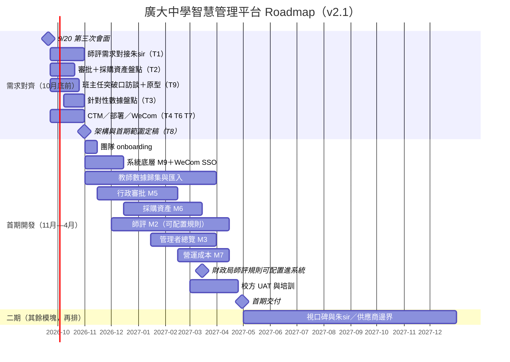

# 廣大中學智慧管理平台 — 項目 Roadmap

**用途：** 9/20 第三次會面後的執行基線（團隊內部；對校方溝通用同一套時間與範圍）  
**版本：** v2.1｜2026-09-21  
**依據：** 《校園管理系統第三次會面會議紀要》（2026-09-20）；模塊編號沿用 08-24 定稿（M1–M9）  
**團隊：** 梁子鋒（統籌／數據）、陳堯法（阿法，UI/UX／前端）、James（技術負責人）

---

## 〇、策略基線（9/20 已確認）

1. **廣大不是「無系統」。** 現況是多套並存、互不相通：師悅學籍（今年啟用，數據在 CTM）、e-Class（打卡／家長通知／資產，數據在港）、科大訊飛智學網（出卷／評估）、企業微信、Google Drive、大量 Excel／紙本。
2. **定位＝補充，不是取代。** 成熟系統難撼動；游擊隊打法——先做「最痛、最細、最快見效」的一塊，做出示範與口碑再擴張。正面不撞科大訊飛／師悅／e-Class。
3. **市場空白＝師評＋行政審批。** 上述系統都沒有做好這兩塊；企業微信內建審批難用、澳門買 WeCom 付費／小程序不便 → 自建審批填缺口。審批延伸為「採購→驗收→報銷→資產登記」一條龍（M6），管理者要能看見開支與趨勢（M3／M7）。
4. **首期範圍：** **M9 底層 ＋ M2 師評 ＋ M5 審批 ＋ M6 採購資產 ＋ M3 管理者總覽（開支／審批／教師狀態）＋ M7 營運成本。** **二期只排其餘模塊**：視老師口碑，以及與 **朱sir／師悅／訊飛** 的邊界再決定（主要是 **M1 學生**，以及 M4 科組、M8 排課、教青局直連、人臉／智慧體育等）。
5. **產品形態：** 本地（雲）部署 **webapp ＋ PWA／WeCom 小程序**；老師 **WeCom SSO** 登入。必要時以 webapp／PWA 為主，避開澳門購買小程序的摩擦。
6. **合規硬約束：** 澳門《個人資料保護法》（第 8/2005 號法律）——學生／教師個資不出境；學籍留 CTM；上雲須 hash／加密；傾向**全部本地部署**。
7. **硬時限：** **2027 年 4 月前完成首期。** 師評規則由朱sir 主導、財政局預計 **2027 年 3 月** 才出 → 規則未定稿前先歸集教師數據，系統做成**可配置規則引擎**。
8. **商業／政策（平行，不擋開發）：** 以廣大作示範，面向全澳 68 間私校（主攻中小型）；爭取教青局資助與政府／中聯辦／北大等背書。

---

## 一、我們要交付什麼

| 階段 | 時間 | 交付物 |
| --- | --- | --- |
| **需求對齊** | 2026 年 10 月底前 | 師評／審批／採購資產需求定稿、針對性數據盤點、架構與部署方案、突破口原型 |
| **首期** | 2027 年 4 月底前 | 可日常使用的 **師評＋四級審批＋採購資產主鏈＋管理者開支／成本總覽**（WeCom SSO、本地部署）；教師歷史資料已開始歸集 |
| **二期** | 視口碑與邊界 | **僅其餘模塊再排**：M1 學生、M4 科組資源、M8 排課、教青局直連、人臉／智慧體育等——須先與朱sir／供應商劃清範圍，並看首期口碑再開工 |

> **怎麼算首期「完成」：** 老師能在熟悉的 WeCom／瀏覽器提交申請並看到進度；四級簽核留痕、可追溯；採購→驗收→報銷→資產登記可跑通；教師進修／獲獎／帶隊等資料一次錄入、可匯出教青局 CSV；校長能查待辦、開支明細與趨勢，不再靠紙本與記憶。RFID 盤點、人臉進出校、學生 360、家長門戶、排課、科組教案庫、取代 e-Class／師悅——**均不在首期成功標準內**（屬二期再議）。

---

## 二、團隊分工

訪談與對接以**需求驅動**（先 T1／T2，再盤數據）；**11 月起三人並行開發**，11 月為 onboarding，不預期滿產能。

### 2.1 需求對齊（2026 年 9–10 月）

| 成員 | 分工 |
| --- | --- |
| **梁子鋒** | 統籌；對接校辦／馬sir／總務（T2，含採購資產流）；針對性數據盤點（T3）；朱sir 師評時程協同（T1） |
| **陳堯法** | UI/UX；班主任／前線老師訪談找突破口（T9）；師評錄入＋審批／採購流＋管理者總覽設計稿 |
| **James** | 權限／審計／學年切換；技術架構；本地部署與脫敏（T6）；WeCom SSO 與教青局租戶（T7）；CTM 定時 ETL 可行性（T4） |

### 2.2 開發階段（2026 年 11 月 — 2027 年 4 月）

| 成員 | 分工 |
| --- | --- |
| **James** | 技術負責人：M9 底層、WeCom SSO、本地部署、可配置師評規則引擎、審批／採購工作流、CTM 導出導入、code review |
| **陳堯法** | 前端實作＋UI 迭代：審批流、採購資產、教師檔案／成長紀錄、校長開支／成本總覽、手機／PWA、UAT 修正 |
| **梁子鋒** | **~30%** 校方統籌與需求澄清（朱sir、馬sir、總務）；**~70%** 教師紙本／Excel 與資產清單歸集、清洗與匯入、教青局 CSV 匯出；在 James 帶領下 **Q1 逐步接業務 API** |

> 梁子鋒背景偏 Python、Excel、SQL、Power Query，對口教師紙本／進修表、資產盤點表與日後 CTM 導出檔。Web API 由 James 定標；首季以 **數據歸集＋匯入匯出** 為主。

### 2.3 模塊分工（11 月後）

| 模塊 | James | 梁子鋒 | 陳堯法 |
| --- | --- | --- | --- |
| 系統底層（M9） | **主責** | — | PWA／登入體驗 |
| 教師／師評（M2） | 規則引擎、權限 | 歸集＋匯入＋CSV；業務 API（漸進） | **前端主責** |
| 行政審批（M5） | 工作流引擎、審計 | 表單欄位／部門對照 | **前端主責** |
| 採購資產（M6） | 與 M5 銜接 | 資產清單匯入（e-Class 可導出則匯入） | **前端主責** |
| 管理者總覽（M3） | 聚合 API | 協助 API | **主責** |
| 營運成本（M7） | 統計／異常邏輯 | 協助 API | 前端 |
| 數據對接（CTM／CSV） | ETL 框架 | **主責（檔案與清洗）** | — |

### 2.4 11 月開工前必備（10/31 前）

| 交付物 | 負責 |
| --- | --- |
| 首期範圍定稿（M2＋M5＋M6＋M3＋M7＋M9） | 全員（T8） |
| 權限模型、技術架構、本地部署方案、WeCom SSO 結論 | James（T6／T7／T8） |
| Repo、CI、API 規範 | James |
| 首期主流程 UI（登入、申請／簽核、採購資產、教師成長紀錄、校長開支總覽） | 陳堯法 |
| 師評所需數據清單＋樣本清洗腳本（紙本／Excel） | 梁子鋒（T1／T3） |
| 審批層級、表單種類、部門清單、採購→資產全流程（至少 1–2 類可開發） | 梁子鋒、陳堯法（T2） |

**12 月底內部驗收：** 梁子鋒完成一條只讀 API（如教師檔案查詢）＋一份真實樣本清洗 pipeline；通過 James review 後，Q1 加大 API 範圍。

---

## 三、總體時間線

---

## 四、分階段詳情

### 4.1 階段 1：需求對齊（2026 年 9 月 — 10 月底）

**目標：** 現況已在 9/20 釐清，**不再做全校數據普查**。先鎖定師評、審批與採購資產要哪些數據、哪一個功能是老師的突破口，再針對性盤點；同時定死架構與合規部署，確保 11 月能開工。

對應會議紀要待辦 **T1–T4、T6–T9**（T5 智慧體育／人臉、T10 政策資助、T12 法律意見與開發並行，不擋 10/31 開工包；屬二期再議範圍）。

| 週次 | 工作 | 交付 | 需要校方配合 |
| --- | --- | --- | --- |
| 9/22 — 9/30 | 對接朱sir（師評時間表／所需數據維度）；啟動校辦＋總務審批／採購訪談；James 開部署／WeCom 調研 | 訪談紀錄（首批）；師評數據維度草稿 | 介紹朱sir、校辦、總務、馬sir |
| 10/1 — 10/15 | 審批層級／表單／部門／採購鏈定稿（至少 1–2 類）；班主任突破口訪談；CTM 服務清單 | 《審批與採購流說明》草稿；突破口候選 | 馬sir 協助看 CTM；安排 2–3 位班主任 |
| 10/16 — 10/25 | 針對 T1／T2 做數據盤點（含資產清單能否從 e-Class 導出）；突破口低保真原型；部署與 SSO 結論 | 數據清單（形式／位置／能否數位化）；原型反饋 | 提供教師進修／獲獎紙本或 Excel、資產盤點樣本 |
| 10/26 — 10/31 | 整合定稿 | **首期範圍＋架構＋UI＋清洗腳本齊備** | 校方口頭確認首期範圍、**不取代學籍／e-Class／智學網** |

#### 10/31 開工包內容

1. **師評（T1）** — 評分維度（進修／培訓／獲獎／帶隊／教研／論文等）、規則時間表、系統可配置原則；教青局培訓 CSV 必填欄位  
2. **審批＋採購資產（T2）** — 四級路徑（老師→科組長／主任→副校長→校長）、表單種類、部門（校辦、總務、教務等）、採購→驗收→報銷→資產登記  
3. **數據（T3）** — 僅覆蓋上面所需來源（紙本／Excel／師悅教師基礎欄／資產清單），不普查學籍全庫  
4. **技術（T4／T6／T7／T8）** — CTM 能否定時導出；本地部署＋備份責任；WeCom SSO 可行性與教青局租戶上架路徑；角色權限、學年切換、審計日誌  

---

### 4.2 階段 2：首期開發（2026 年 11 月 — 2027 年 4 月）

**目標：** 2027 年 4 月底前，師評、四級審批、採購資產主鏈、管理者開支／成本總覽可在校內日常使用。

#### 4.2.1 架構定稿（延續至 11 月上旬）

| 事項 | 負責 | 產出 |
| --- | --- | --- |
| 角色權限（校長／副校／主任／科組長／教師／總務） | James | 權限設計文檔 |
| 學年切換與人員職務變更 | James | 狀態機設計 |
| 審計日誌（申請／簽核／錄入不可抵賴） | James | 日誌方案 |
| 技術選型、Repo、CI、API 規範 | James | 架構決策紀錄 |
| 本地部署、hash／加密紅線、備份運維 | James | 部署方案 |
| 可配置師評規則引擎（分數項、權重、學年） | James | 規則模型 |
| 審批與採購工作流銜接 | James | 流程模型 |
| 首期主流程界面 | 陳堯法 | 設計稿（10/31 前骨架，11 月迭代） |
| 教師／資產樣本清洗＋教青局 CSV 模板 | 梁子鋒 | Python pipeline |

#### 4.2.2 開發節奏

| 月份 | 開發重點 | 主要負責 | 里程碑 |
| --- | --- | --- | --- |
| **2026/11** | M9 底層＋onboarding；WeCom／帳號打通；教師樣本入庫試跑 | James（底層）；梁（數據）；陳（前端環境） | 內部可登入（SSO 或過渡帳號） |
| **2026/12** | M5 申請單＋待辦；教師檔案只讀；M6 欄位／主鏈骨架；API ramp-up 驗收 | 三線並行 | 一類表單可在內部走通草稿流 |
| **2027/01** | M5 四級簽核＋時間戳＋催辦；教師自行錄入；M6 接到審批；M3 待辦骨架 | 陳（UI）；James＋梁（API／遷移） | **審批主路徑可用（測試環境）** |
| **2027/02** | M2 成長紀錄、CSV、手機／PWA；規則引擎接假規則；M6 主鏈跑通；M7 報表骨架 | 陳（UI）；梁（API 漸進） | 教師可自助錄入；採購鏈內部可跑 |
| **2027/03** | **財政局／朱sir 規則進配置**；M3 開支總覽；M7 趨勢／單價異常；功能凍結；校方 UAT | 全員 | 師評可按校本規則試算；校長可看開支 |
| **2027/04** | UAT＋培訓＋修正；部署到 CTM／校方指定環境 | 梁（統籌）；陳（UI）；James（修復／上線） | **首期交付** |

> M6 **納入首期**，不做 RFID、不取代 e-Class 盤點分析；e-Class 資產能導出則匯入，否則重新建冊。M7 上線時流水可能尚短，先交付報表與異常框架，數字隨使用累積。產能不夠時**先保深度、後保廣度**：師評＋審批主路徑不可砍；M7 細項可簡化，但模塊仍留在首期，不挪到二期。

#### 4.2.3 首期交付時校方可以做的事

- 老師用 WeCom／瀏覽器提交申請，看到卡在哪一級、何時處理
- 科組長／主任／副校／校長在線上簽核；每步有時間戳，可查、可催、少扯皮
- 採購→驗收→報銷→資產登記在同一條鏈上完成，總務有資產清冊
- 校長／主任手機可看待辦紅點、審批與開支去向、教師請假／公幹（來自 M5／M2）
- 開支趨勢、單價異常有基本圖表（數據隨使用變厚）
- 教師建立個人檔案：進修、培訓、獲獎、帶隊、教研／論文；歷史紙本已開始掃描／錄入
- 匯出教青局所需培訓 CSV，減少重複填報
- 朱sir 的計分規則以配置生效（例：大課室一等獎 +1 分），學年可改、不必改代碼

**明確不做（首期，留待二期再議）：** 學生 360／地址搜尋／兄弟姊妹（M1）；全校實時出勤駕駛艙（依賴 e-Class／師悅，且考勤口徑今年改為入課室才算遲到）；科組教案庫（學校已用 Google Drive）；自動排課；家長 App；人臉進出校；RFID 盤點。

---

### 4.3 階段 3：二期（其餘模塊，視口碑與邊界再排）

首期 **4 月底交付** 後不預排開發月表。二期**只**處理與現有供應商重疊、或須靠口碑才能推的其餘模塊；開工前須書面確認範圍。

| 模塊 | 內容 | 再排前提 |
| --- | --- | --- |
| **M1 學生** | 08-24 的歷史檔、搜尋、地址、家庭關聯等 | 與朱sir、師悅、訊飛劃清邊界；CTM ETL 可行；首期口碑站得住 |
| **M4 科組資源** | 教案歸校 | 已有 Google Drive；非市場空白；老師覺得值得再做 |
| **M8 排課** | — | 師悅已有排課；原則上不主動做 |
| 教青局直連 | 局校系統對接 | 首期只做 CSV；直連涉公網安全 |
| 智慧體育／人臉考勤（T5／T12） | 進出校／考勤 | 法律意見通過；家長同意；數據回澳；未過關不上線 |
| RFID 盤點 | 資產盤點加速 | 錦上添花；一年盤一次可接受 |

**家長：** 08-24 的家長會調檔、家庭聯絡屬 M1，隨學生模塊走二期再議。**不含家長自行登入門戶。** 會議提及的「消費通知家長」屬更遠期賣點，不進首期。

---

## 五、需要校方配合的關鍵節點

| 時間 | 校方行動 | 影響 |
| --- | --- | --- |
| **即時 — 10 月** | 朱sir 對接師評維度與時間表；校辦／總務講清審批與採購紙本流 | 10/31 能否開工 |
| **10 月** | 馬sir／資訊：CTM 上有哪些庫、能否定時導出；教師紙本／Excel、資產清單樣本 | 歸集與 ETL 方案 |
| **10 月底** | 確認首期範圍、不取代學籍／e-Class／智學網 | 避免撞車 |
| **11–12 月** | 指定試用老師；WeCom 租戶／帳號配合（若走 SSO） | 登入能否落地 |
| **2027/01** | 持續提供教師歷史資料、配合採購／資產試跑 | 師評與 M6 不是空殼 |
| **2027/03** | 朱sir／財政局規則文本；安排 UAT（校長、主任、科組長、總務、普通老師） | 規則與全鏈能否驗收 |
| **2027/04** | 試用反饋與培訓；必要時以校方政策推動老師使用 | 首期能否養成習慣 |
| **2027/05 起** | 視口碑決定是否談 M1 等其餘模塊；與朱sir／供應商對齊邊界 | 二期是否開工 |

---

## 六、風險與應對

| 風險 | 可能性 | 應對 |
| --- | --- | --- |
| 師評規則拖過 3 月或反覆改 | 高 | 引擎可配置；3 月前只做數據歸集與錄入，不算分也可以上線 |
| 首期模塊多、三人產能不足 | 高 | 節奏上 M5→M6→M3／M7 串行銜接；M7 可簡化深度；**不把模塊踢出首期**；12 月底 API 驗收再加碼 |
| 朱sir／其他供應商做學生端，範圍再擴張撞車 | 中 | 首期不碰 M1；任何學生功能上馬前書面對齊（二期閘門） |
| 師悅已覆蓋學籍，我方若做學生檔被視為重複建設 | 中 | 學生數據只走 CTM 定時導出（若二期需要），不重建學籍 |
| 突破口選錯，老師覺得「又多一個系統」 | 中 | T9 先驗證；對老師敘事用「少填表、成長紀錄、申請有下文」，避免開口「考核／KPI」 |
| WeCom 小程序無法上架教青局租戶 | 中 | **webapp／PWA 為主路徑**；SSO 能做再做；不綁死小程序購買 |
| 澳門付 WeCom 付費功能不便 | 中 | 自建審批，不依賴 WeCom 內建 OA |
| 個資不出境／上雲受限 | 高（硬約束） | 預設全部本地（CTM）；上雲只允許去識別化欄位 |
| 人臉／智慧體育合規 | 中 | T5／T12 先法律意見；未過關不進開發（二期再議） |
| e-Class 無 API、課室點名拿不到 | 高（已確認） | 首期不做出勤駕駛艙；不截校門拍卡；資產能導出則匯入 |
| 教師紙本分散、歷史歸集慢 | 高 | 分批掃；先近學年；一次錄入多方用 |
| 10/31 開工包不齊 | 中 | 硬截止：範圍、架構、UI、樣本清洗缺一不可才全速開發 |
| 一口想吃大象（加回 M1 全量） | 中 | 本 Roadmap 為準；M1 等其餘模塊須過二期閘門 |
| 政策資助／示範條款未定 | 中 | T10 平行；不擋 4 月產品交付 |

---

## 七、模塊與階段對照

### 首期（2027 年 4 月底前）

| 模塊 | 功能 |
| --- | --- |
| **M9 系統底層** | 角色權限、學年／職務切換、審計日誌、導入導出、本地部署、WeCom SSO（能定則定）、擴充接口 |
| **M2 教師／師評** | 教師檔案；進修／培訓／獲獎／帶隊／教研錄入；歷史歸集；教青局 CSV；**可配置計分**（對老師溝通稱成長紀錄） |
| **M5 行政審批** | 表單電子化；四級簽核；時間戳與催辦；申請人可見進度 |
| **M6 採購與資產** | 採購→驗收→報銷→資產登記；資產清冊；維修紀錄視訪談能定則做。不做 RFID、不做盤點分析取代 e-Class |
| **M3 管理者總覽** | 審批待辦紅點、開支去向、教師狀態（請假／公幹）、手機可查。**不含**全校學生實時出勤駕駛艙 |
| **M7 營運成本** | 開銷趨勢、單價異常；上線初期數據短，框架先交付 |

### 二期（僅其餘模塊，視口碑與朱sir／供應商邊界再排）

| 模塊 | 功能 | 目標 |
| --- | --- | --- |
| M1 學生 | 08-24 P0／P1（歷史檔、搜尋、地址、家庭關聯等） | 對齊後另開基線 |
| M4 科組資源 | 教案歸校 | 視口碑 |
| M8 排課 | — | 原則上不主動做 |
| 教青局直連 | 局校對接 | 待定 |
| T5 人臉／智慧體育 | — | 僅研究，通過才進開發 |
| RFID | 盤點加速 | 錦上添花 |

---

## 八、與 08-24／舊 Roadmap 的差異（便於對內對齊）

| 項目 | 08-24／v1.x | v2.1（本版） |
| --- | --- | --- |
| 學校現況 | 以為以 e-Class＋Excel 為主、接近無系統 | 師悅＋e-Class＋智學網＋WeCom＋Drive＋Excel |
| 首期 | 師生檔＋校長總覽＋科組（約「75%」） | **師評＋審批＋採購資產＋開支／成本總覽**；學生／出勤駕駛艙／科組教案不做 |
| 審批／資產／成本 | 放 2027 年 6–12 月（二期） | **全部提前到 2027 年 4 月首期** |
| 二期 | 行政、採購、排課、營運 | **只留其餘模塊**（M1／M4／M8／直連／人臉等），視口碑與供應商邊界再排 |
| 學生（M1） | 一期核心 | **二期閘門** |
| 10 月產出 | 全校《數據地圖》 | **需求驅動**的師評／審批／資產盤點＋架構開工包 |
| 部署 | 會上未談 | 本地 webapp＋PWA／小程序、WeCom SSO |
| 打卡／e-Class | 一期至少導入打卡 | 拍卡非遲到口徑、無 API → 首期不對接出勤；資產能導出則匯入 |
| 展示會 | 9/20 向校方講舊時間表 | 9/20 已開會並 pivot；本文件為會後 re-baseline |

模塊定義（M1–M9 功能清單）仍以《需求訪談會議紀要-定稿-2026-08-24》為準；**只改優先序與時間，不改編號。**

---

## 九、關鍵日期一覽

| 日期 | 里程碑 |
| --- | --- |
| **2026-09-20** | 第三次會面；策略 pivot（已完成） |
| **2026-10-31** | **開工包定稿**：範圍、架構、UI、樣本清洗、部署／SSO 結論 |
| 2026-11-01 | 正式開發（11 月 onboarding） |
| 2026-12-31 | M9 可登入；M5 內部草稿流；M6 骨架；API ramp-up 驗收 |
| 2027-01-31 | 審批四級主路徑在測試環境可用；M6 開始接審批 |
| 2027-02-28 | 教師可自助錄入；CSV 匯出；採購鏈內部可跑 |
| **2027-03** | 財政局／朱sir 規則配置進系統；M3／M7 可看開支；UAT 啟動 |
| **2027-04-30** | **首期交付**（M2＋M5＋M6＋M3＋M7＋M9） |
| 2027-05 起 | 二期閘門：其餘模塊視口碑與朱sir／供應商邊界再排 |

---

## 十、即時待辦（摘自 9/20 紀要，執行用）

| # | 事項 | 負責 | 與本 Roadmap |
| --- | --- | --- | --- |
| T1 | 師評需求與規則（可配置）；教青局 CSV | 團隊＋朱sir | 鎖 M2 |
| T2 | 審批流與採購全流程盤點 | 梁子鋒、陳堯法 | 鎖 M5＋M6 |
| T3 | 針對 T1／T2 的數據盤點 | 梁子鋒、陳堯法 | 取代全量數據地圖 |
| T4 | CTM 服務／定時導出導入 | 團隊＋馬sir | 教師基礎資料；二期 M1 前提 |
| T5 | 智慧體育＋人臉合規調研 | 團隊 | 二期再議 |
| T6 | 本地部署／脫敏 | James | M9 |
| T7 | WeCom SSO、PWA、教青局租戶 | James | 產品形態 |
| T8 | 首期範圍＋架構 | James／團隊 | 10/31 |
| T9 | 突破口訪談＋原型 | 梁子鋒、陳堯法 | 避免做錯第一個功能 |
| T10 | 資助／背書／示範條款 | 團隊＋馬sir | 平行 |
| T12 | 法律意見（人臉、跨境、脫敏上雲） | 團隊＋馬sir | 支撐 T5／T6 |

（紀要 T11＝本文件，已完成 re-baseline。）

---

*v2.1（2026-09-21）：首期納入 M2／M5／M6／M3／M7／M9；二期僅其餘模塊，視口碑與朱sir／供應商邊界再排。實際進度隨 T1–T3 調整；重啟 M1 等須過二期閘門並改版本號。*
