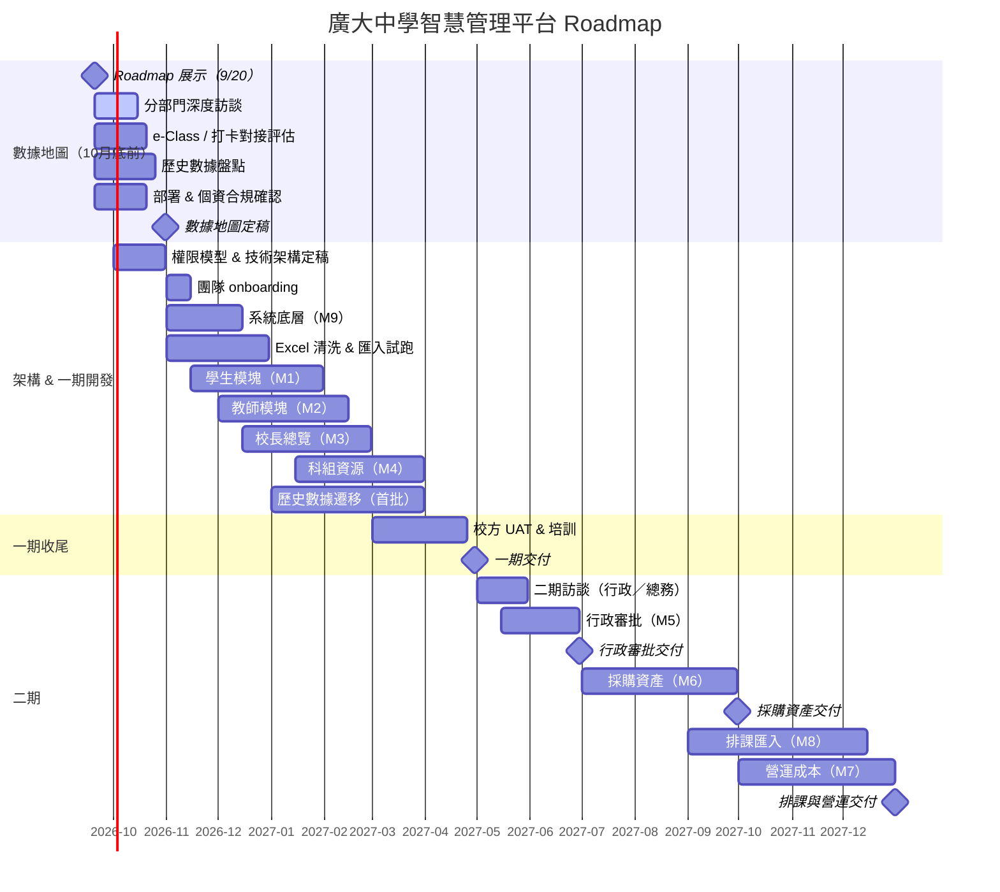

# 廣大中學智慧管理平台 — 項目 Roadmap

**用途：** 2026 年 9 月 20 日向校方展示整體計劃與時間表  
**版本：** v1.5｜2026-09-18  
**團隊：** 梁子鋒（統籌 → 數據／後端）、陳堯法（UI/UX → 前端）、James（技術負責人）

---

## 一、我們要交付什麼

| 階段 | 時間 | 交付物 |
| --- | --- | --- |
| **數據地圖** | 2026 年 10 月底前 | 全校數據現況圖 + 遷移計劃 |
| **一期（約 75%）** | 2027 年 4 月底前 | 師生檔案、校長總覽、科組資源，可日常使用 |
| **二期（約 25%）** | 2027 年 5–12 月 | 行政審批（6 月）、採購資產（9 月）、排課與營運（12 月）；教青局直連視政策推進 |

> **「75%／25%」怎麼算：** 校長日常查校況、班主任帶班、教師錄入與成長紀錄、科組資源沉澱——這些在一期做完。家長會調檔、家庭聯絡等場景已由一期學生 360 覆蓋，**不含家長自行登入的門戶**。行政審批、採購／資產／排課／成本分析是另一套業務流，等行政／總務訪談清楚後按時序推進。**此分批是為 4 月／年底交付而擬的計劃，不是 8/24 會議已拍板的範圍。**

---

## 二、團隊分工

訪談階段以了解現況為主；**11 月起三人並行開發**，11 月為 onboarding 月，不預期滿產能。

### 2.1 訪談階段（2026 年 9–10 月）

| 成員 | 分工 |
| --- | --- |
| **梁子鋒** | 統籌、分部門訪談、Excel／e-Class 數據盤點、教青局 CSV 欄位確認 |
| **陳堯法** | UI/UX、到校訪談、一期主流程設計稿 |
| **James** | e-Class 技術評估、權限模型、架構與部署方案 |

### 2.2 開發階段（2026 年 11 月 — 2027 年 4 月）

| 成員 | 分工 |
| --- | --- |
| **James** | 技術負責人：系統底層、權限、審計、學年切換、遷移框架、e-Class 對接、部署、code review |
| **陳堯法** | 前端實作 + UI 迭代：校長駕駛艙、學生／教師頁面、手機適配、UAT 界面修正 |
| **梁子鋒** | **~30%** 校方統籌與需求澄清；**~70%** 數據整合——Excel 清洗、匯入 pipeline、培訓 CSV 匯出；在 James 帶領下 **Q1 逐步接業務 API**（非 11 月即獨立負責） |

> 梁子鋒背景偏 Python、Excel、SQL、Power Query，與廣大「各部門 Excel 五花八門」的現況高度對口；Web API 框架由 James 定標，首季以 **數據遷移 + 匯入匯出** 為主，業務 API 漸進接手。

### 2.3 模塊分工（11 月後）

| 模塊 | James | 梁子鋒 | 陳堯法 |
| --- | --- | --- | --- |
| 系統底層（M9） | **主責** | — | — |
| 學生（M1） | 搜尋、家庭關聯 | 匯入 + 業務 API（漸進） | **前端主責** |
| 教師（M2） | CSV 格式定案 | 匯出 + 業務 API（漸進） | **前端主責** |
| 校長總覽（M3） | 出勤聚合邏輯 | 協助 API | **主責** |
| 科組資源（M4） | 檔案存儲方案 | 協助 API | 前端 |
| 數據遷移 | 框架與 schema | **主責** | — |

### 2.4 11 月開工前必備（10/31 前）

| 交付物 | 負責 |
| --- | --- |
| 權限模型、技術架構、部署方案 | James |
| Repo、CI、API 規範、模塊邊界 | James |
| 一期主流程 UI（登入、校長駕駛艙、學生 360、教師錄入） | 陳堯法 |
| Excel 欄位對照 + 試跑清洗腳本 | 梁子鋒 |

**12 月底內部驗收（API ramp-up）：** 梁子鋒完成一條只讀 API（如學生搜尋）+ 一份真實樣本 Excel 清洗 pipeline；通過 James review 後，Q1 加大 API 範圍。

---

## 三、總體時間線

---

## 四、分階段詳情

### 4.1 階段 1：數據地圖（2026 年 9 月 — 10 月底）

**目標：** 在動手寫系統之前，先把廣大的數據現況理清——資料在哪、誰維護、能否搬、怎麼對接。

| 週次 | 工作 | 交付 | 需要校方配合 |
| --- | --- | --- | --- |
| 9/20 — 9/30 | **9/20 Roadmap 展示**；開始分部門訪談 | 訪談紀錄（首批） | 安排總務、教務、學務、行政、資訊、校醫 |
| 10/1 — 10/15 | 持續訪談；e-Class 技術評估；Excel 盤點 | 各部門數據清單草稿 | 資訊老師提供 e-Class 存取／導出方式 |
| 10/16 — 10/25 | 數據欄位對照；遷移可行性評估；個資／部署方案 | 遷移計劃草案 | 確認歷史 Excel 存放位置與年份 |
| 10/26 — 10/31 | 整合定稿 | **《廣大中學數據地圖》** | 校方審閱確認 |

#### 《數據地圖》將包含：

1. **數據來源清單** — e-Class、各部門 Excel、紙本、其他系統
2. **數據流向圖** — 誰錄入、誰使用、重複錄入在哪發生
3. **欄位對照表** — 現有欄位 → 新系統欄位映射
4. **遷移計劃** — 哪些先搬、哪些後搬、預估工作量
5. **對接方案** — e-Class 打卡數據如何進入新系統（導入／接口）
6. **部署建議** — 校內伺服器 vs 本地雲、個資法合規路徑
7. **風險清單** — 資料缺失、格式不一、權限不明等

---

### 4.2 階段 2：架構定稿 & 一期開發（2026 年 11 月 — 2027 年 4 月）

**目標：** 2027 年 4 月底前交付可日常使用的一期系統。

#### 4.2.1 架構定稿（2026 年 10 — 11 月）

| 事項 | 負責 | 產出 |
| --- | --- | --- |
| 權限模型（校長／主任／教師／班主任修改權） | James | 權限設計文檔 |
| 學年切換 & 班主任交接流程 | James | 狀態機設計 |
| 技術選型、Repo、CI、API 規範 | James | 架構決策紀錄 |
| 一期主流程界面設計 | 陳堯法 | 設計稿（10/31 前） |
| 教青局培訓紀錄匯出格式 | 梁子鋒、陳堯法 | CSV 模板 |
| Excel 欄位對照 & 試跑清洗腳本 | 梁子鋒 | Python 清洗 pipeline |

#### 4.2.2 開發節奏（2026 年 11 月 — 2027 年 4 月）

| 月份 | 開發重點 | 主要負責 | 里程碑 |
| --- | --- | --- | --- |
| **2026/11** | 底層 + onboarding；Excel 清洗試跑 | James（底層）；梁（數據）；陳（前端環境） | 內部可登入 |
| **2026/12** | 學生核心 + 校長骨架；測試數據入庫；API ramp-up 驗收 | 三模塊並行 | 校長可看真實出勤 |
| **2027/01** | 學生完整 + 教師核心；首批歷史遷移 | 梁（遷移）；陳（前端）；James + 梁（API） | 學生檔案可查真資料 |
| **2027/02** | 教師完整 + 手機端 + 異常提示；科組資源 | 陳（M3/M2 UI）；梁（M2 API 漸進） | 教師可錄入培訓 |
| **2027/03** | 科組資源收尾 + 內部試用；啟動校方 UAT | 全員 | 功能凍結 |
| **2027/04** | 校方 UAT + 培訓 + 修正 | 梁（統籌）；陳（UI）；James（修復） | **一期交付** |

#### 4.2.3 一期交付時校方可以做的事

- 校長手機查看全校出勤、教師請假公幹；有待辦／異常提示
- 搜尋人名或院校，調出學生多年成績、獎項、品行
- 按住址篩出住附近的學生（突發事件關懷）
- 辨識同一家庭／兄弟姊妹、查校友關聯
- 班主任查看本班名單與交接資料
- 教師自行錄入培訓、獲獎、帶隊紀錄，並可匯出給教青局
- 科組上傳教案／課件（歸學校）
- 歷史資料已遷移進系統（首批）

> 行政線上申請與多級審批（M5）放二期——審批層級與表單種類待行政部門訪談確認，且與一期核心場景（校長查校況、師生檔）無直接依賴。

---

### 4.3 階段 3：二期（2027 年 5–12 月）

一期 **4 月底交付** 後，**5 月緩衝並啟動二期訪談**（行政、總務），再按模塊時序推進——避免與一期 UAT 重疊，也避免短期內堆疊全部模塊。

| 時間 | 模塊 | 交付重點 |
| --- | --- | --- |
| 2027/5 — 6 月 | M5 行政審批 | 1–2 類表單上線；多級審批跑通 |
| 2027/7 — 9 月 | M6 採購與資產 | 採購→驗收→報銷→資產主流程可用 |
| 2027/9 — 12 月 | M8 排課 + M7 營運成本 | 課表**匯入**先行；成本分析待 M6 有數據後啟動（約 10 月起） |

#### 二期各模塊說明

| 模塊 | 內容 | 放二期的原因 | 預計完成 |
| --- | --- | --- | --- |
| M5 行政審批 | 線上申請、多級審批、時間戳提醒 | 審批層級與表單種類待行政部門訪談確認 | 2027/06 |
| M6 採購與資產 | 採購→驗收→報銷→資產登記 | 總務獨立流程；表單種類待訪談確認 | 2027/09 |
| M8 排課 | 課表匯入（自動排課視需求再議） | 規則每年在變；勞校亦曾外包後匯入 | 2027/12 |
| M7 營運成本 | 開銷趨勢、採購異常、病假統計 | 依賴 M6 採購／資產資料 | 2027/12 |
| M2 教青局直連 | 局校系統對接 | 涉公網安全，須經中華教育會層面商討；一期先做校內錄入 + CSV 匯出 | 待定 |

#### 二期開發節奏

| 月份 | 重點 | 里程碑 |
| --- | --- | --- |
| **2027/05** | 一期收尾緩衝；行政／總務二期訪談 | 行政審批需求定稿 |
| **2027/06** | M5 開發 + 試用 | **行政審批交付** |
| **2027/07 — 08** | M6 主流程開發 | 內部可跑通採購鏈 |
| **2027/09** | M6 試用 + 修正 | **採購資產交付** |
| **2027/10 — 11** | M8 課表匯入；M7 成本分析（依 M6 數據） | 功能凍結 |
| **2027/12** | 試用 + 修正 | **排課與營運交付** |

---

## 五、需要校方配合的關鍵節點

| 時間 | 校方行動 | 影響 |
| --- | --- | --- |
| **9/20** | 參加 Roadmap 展示；確認分部門訪談時間表 | 數據地圖能否按時完成 |
| **10 月** | 各部門配合訪談；提供 Excel 樣本與 e-Class 資訊 | 數據地圖品質 |
| **10 月底** | 審閱《數據地圖》定稿 | 開發能否 11 月啟動 |
| **2027/01** | 提供首批歷史數據用於遷移測試 | 一期能否有真資料 |
| **2027/03** | 安排試用人員（校長、主任、班主任各 1–2 人） | UAT 能否準時啟動 |
| **2027/04** | 配合試用反饋與培訓 | 一期交付品質 |
| **2027/05** | 配合行政、總務二期訪談 | 二期需求能否定稿 |
| **2027/06** | 安排行政審批試用人員 | 行政審批交付品質 |
| **2027/09** | 配合採購流程試用 | 採購資產交付品質 |
| **2027/12** | 配合排課匯入與成本報表試用 | 排課與營運交付品質 |

---

## 六、風險與應對

| 風險 | 可能性 | 應對 |
| --- | --- | --- |
| 分部門訪談排期延遲 | 中 | 9/20 會上先鎖定時間表；週末／晚間茶敘備選 |
| e-Class 無法導出打卡數據 | 中 | 數據地圖階段確認；必要時初期手動導入 |
| 歷史 Excel 格式極不統一 | 高 | 梁子鋒主責清洗；遷移分批次；先搬近 3 年核心資料 |
| 老師抗拒錄入 | 中 | 對老師只談減少重複、個人成長紀錄 |
| 個資法限制資料存放位置 | 中 | 10 月優先確認；預設校內部署 |
| 一期範圍過滿 | 中 | 行政審批已放二期；採購／排課／成本亦在二期；不砍師生檔與校長查詢 |
| 後端 onboarding 進度不均 | 中 | 11 月為 ramp-up；梁先主攻數據；12 月底 API 驗收後再加大 API 範圍 |
| 10 月開工包未齊 | 中 | 設 10/31 硬截止；UI、架構、清洗腳本缺一不可才開 11 月全速開發 |
| 二期範圍過滿 | 中 | 按 6／9／12 月分批交付；M7 等 M6 有數據；排課先做匯入 |

---

## 七、一期／二期功能對照

### 一期（2027 年 4 月底前）

| 模塊 | 功能 |
| --- | --- |
| **系統底層** | 角色權限、學年切換、審計日誌、導入導出、擴充接口；e-Class 打卡至少做到導入 |
| **學生** | 完整歷史檔、出勤、成績、獎項、家庭聯絡、關鍵字搜尋；地址／地域查詢；兄弟姊妹／同一家庭；校友關聯；異常預警 |
| **教師** | 教師檔案、培訓錄入、獲獎帶隊、請假公幹；培訓 CSV 匯出；教師數據概覽 |
| **校長總覽** | 實時出勤、教師狀態、趨勢圖表、手機可查、待辦與異常提示 |
| **科組資源** | 教案／課件上傳，歸校方 |

> **家長相關：** 家長會調檔、家庭聯絡、兄弟姊妹辨識等已由學生 360 覆蓋；**不含家長自行登入的門戶**（若日後需要，另議個資與帳號方案）。

### 二期（2027 年 5–12 月）

| 模塊 | 功能 | 目標交付 |
| --- | --- | --- |
| 行政審批 | 線上申請、多級審批、時間戳提醒 | **2027/06/30** |
| 採購與資產 | 採購→驗收→報銷→資產全流程；維修紀錄 | **2027/09/30** |
| 排課 | 課表匯入（自動排課視需求再議） | **2027/12/31** |
| 營運成本 | 開銷趨勢、採購異常提示、病假統計 | **2027/12/31** |
| 教青局直連 | 局校數據對接（政策允許後） | 待定 |

---

## 八、9 月 20 日展示建議流程（約 35 分鐘）

| 時間 | 內容 |
| --- | --- |
| 5 min | 項目背景與核心價值（一次錄入、全校共享） |
| 10 min | Roadmap 時間線：數據地圖 → 一期 → 二期 |
| 5 min | 團隊分工：訪談後三人並行；數據整合 + 前端 + 技術架構 |
| 5 min | 數據地圖要做什麼、需要校方怎麼配合 |
| 5 min | 一期能做什麼、二期時序（6／9／12 月）、為什麼這樣分 |
| 5 min | Q&A；**當場確認訪談時間表** |

---

## 九、關鍵日期一覽

| 日期 | 里程碑 |
| --- | --- |
| **2026-09-20** | **Roadmap 展示** |
| **2026-10-31** | **《數據地圖》定稿**；架構 + 主流程 UI + 清洗腳本齊備 |
| 2026-11-01 | 正式開發啟動（11 月 onboarding） |
| 2026-12-31 | 系統底層 + 學生／校長模塊內部可用；API ramp-up 驗收 |
| 2027-02-28 | 教師模塊完成 |
| 2027-03-31 | 科組資源完成；校方 UAT 啟動 |
| **2027-04-30** | **一期交付 & 校方試用完成** |
| **2027-06-30** | **行政審批交付** |
| **2027-09-30** | **採購資產交付** |
| **2027-12-31** | **排課匯入 & 營運成本交付** |

---

*本 Roadmap 依 2026-08-24 訪談所定模塊擬定交付節奏。實際進度隨數據地圖與分部門訪談調整，重大變更書面通知校方。*
